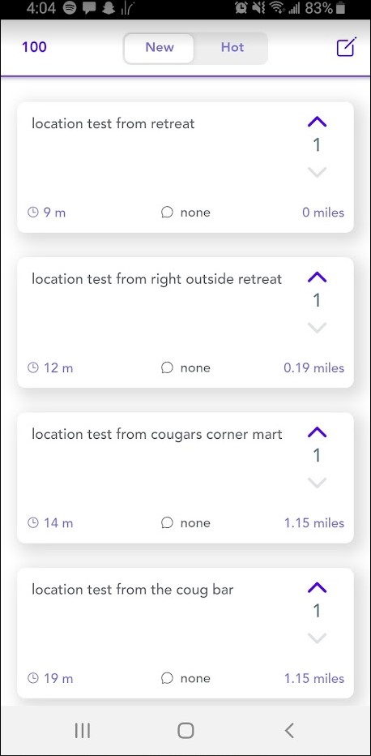

# Within-Reach-App
## Summary
A mobile app for Android and iOS, developed by Lucas Da Silva using Ionic and a flask rest API. The app uses geolocation to anonymously talk to users within a certain mile radius. Similar to YikYak.
Unfortunately, YikYak has come back and launched on IOS & Android so I don't see a need in contuining the project and putting it on the app store. I learned a lot after developing this app!

## Screenshots

### Home Page

### Comments Page

